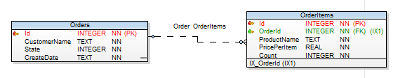

## Zadání
- viz [AlzaUkol.pdf](./doc/AlzaUkol.pdf)

## Databáze
- pro jednoduchost jako databáze použita `sqlite`
- jako orm nakonec použito entity framework, přičemž vytvořena extra OrdersRepository. Myšlenka za vyvořením repository je mít většinu dotazovací logiky pohromadě (oproti volání přímo DbSetu)
- datový model pravděpodobně až příliš zjednodušený a není 100% správně
  

## Struktura projektu
- 1_presentation
  - **AlzaUkol.Api**
    - "REST" api
      - použity pouze GET metody (pro query) a POST metody (pro commandy)
      - namísto HTTP kódů - návratový object `Envelope`
        
    - tenké controllery, většinou pouze volající metodu fasády
    - extras:
      - MyExceptionFilterAttribute - globální odchytávání Exception a překládání do Envelope (viz. Errorové stavy)
      - MyValidationResponse - transformace standardní validační response do Envelope
    - Swagger dostupný přes `/help`
  - **AlzaUkol.Api.Tests**
    - "integrační" testy pro AlzaUkol.Api, testování oproti controllerům
- 2_application
  - **AlzaUkol.Application**
    - aplikační logika
  - **AlzaUkol.Application.Tests**
    - projekt pro unit testy

## Errorové stavy
- uvažoval jsem o použití Result Objectu, ale kvůli zmenšení "ukecanosti" jsem nakonec zvolil vyhazování aplikační výjimky ErrorEx. Tato výjimka je potom na Api vrstvě odchytávána a transformována do Envelope (MyExceptionFilterAttribute).
  

## Validace
- required property označeny attributem `JsonRequired` (NewtonsoftJson), což ošetřuje i validaci chybějících hodnotových typů.
- ostatní validace řešena voláním metody `Validate`. Pro jednoduchost manuální volání, i když už za interfacem IValidatable. V budoucnu by šlo řešit automatické volání metody Validate u IValidatable propert přes reflexi.

## Jmenné konvence
- pokud folder malým písmenem, není použit jako namespace
- DTOs:
  - `IN` suffix -> input DTO
  - `OUT` suffix -> output DTO
  - `IO` suffix -> input i output DTO

## TODOs
- neřešil jsem Autentikaci a Autorizaci (nebylo v zadání zmíněno)
- neřešil jsem Bonus